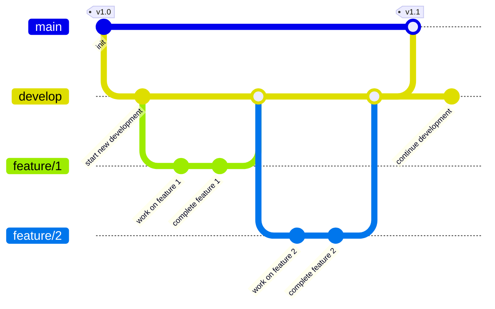

# Speedrun Tracker Frontend

Welcome to the Speedrun Tracker Frontend! This Vue.js application provides the user interface for managing and tracking speedruns, demonstrating modern DevOps practices in frontend development.

## Table of Contents

- [Features](#features)
- [Installation](#installation)
- [Usage](#usage)
- [Testing](#testing)
- [CI/CD Pipeline](#cicd-pipeline)
- [Contributing](#contributing)
- [License](#license)

## Features

- **Game Selection**: Browse and select games from the catalog
- **Speedrun Management**: Record and track speedruns with:
  - Runner information
  - Game selection
  - Category selection (e.g., Any%, 100%)
  - Completion time tracking
  - Date recording
- **Data Visualization**: View and sort speedruns by various criteria
- **Responsive Design**: Adapts to different screen sizes
- **API Integration**: Real-time connection status monitoring

## Installation

To get started with the Speedrun Tracker Frontend, follow these steps:

1. **Clone the repository**:

   ```bash
   git clone https://github.com/yourusername/speedrun-tracker-frontend.git
   cd speedrun-tracker-frontend
   ```

2. **Enable Corepack** (required for first time setup):

   ```bash
   corepack enable
   ```

3. **Install dependencies**:

   ```bash
   yarn install
   ```

4. **Set up environment variables**: Create a `.env` file in the root directory:

   ```plaintext
   VITE_API_BASE_URL=http://localhost:3001
   VITE_API_TOKEN=your_api_token
   HTTP_PORT=8080
   ```

5. **Start the development server**:
   ```bash
   yarn dev
   ```

## Usage

The application provides a user-friendly interface for managing speedruns. You can:

- Select games from the catalog
- Record new speedruns
- View existing speedruns
- Sort and filter speedrun data
- Monitor API connection status

## Testing

### Unit Tests

```bash
# Run tests with coverage
yarn test:coverage

# Run tests in watch mode
yarn test:watch
```

### End-to-End Tests

```bash
# Install Playwright browsers
yarn playwright install-deps
yarn playwright install

# Run E2E tests
yarn test:e2e
```

### Code Quality

```bash
# Lint code
yarn lint

# Format code
yarn format
```

## CI/CD Pipeline

The application uses Jenkins for continuous integration and deployment, implementing a simplified Gitflow workflow. This pipeline serves as a practical example of fundamental DevOps concepts in modern software development.

### Key Learning Objectives

1. **CI/CD Understanding**

   - Automated code flow from development to production
   - Automated testing for code quality assurance
   - Multi-environment deployment strategy

2. **Version Control Workflow**

   - `main`: Production-ready code
   - `develop`: Integration branch for features
   - `feature/*`: Feature development branches

#### Branching Strategy Diagram



3. **Environment Management**

   - Environment-specific configurations
   - Isolation between environments
   - Dynamic port allocation

4. **Infrastructure as Code (IaC)**

   - Docker-based containerization
   - Infrastructure defined in code
   - Consistent deployment environments

5. **Automated Testing Strategy**

   - Unit tests for individual components
   - E2E tests for full application testing
   - Automated test result collection

6. **Pipeline Stages**

   1. Checkout: Code retrieval
   2. Setup: Environment preparation
   3. Unit Tests: Component testing
   4. Build: Docker image creation
   5. Deploy: Environment-specific deployment
   6. E2E Tests: Integration testing
   7. Cleanup: Resource management

7. **Security Best Practices**

   - Secure credential management
   - Environment-specific configurations
   - Environment isolation

8. **Resource Management**

   - Automated cleanup procedures
   - Build history management
   - Environment-specific retention policies

9. **Automation Triggers**
   - SCM polling every 5 minutes
   - Branch-specific behaviors
   - Parameterized builds

### Environment Configuration

#### Ports

- Production (main branch): 8080
- Test (develop branch): 8081
- Feature branches: 5000-5499 (dynamically assigned)

#### Environment IDs

- Production: `prod`
- Test: `test`
- Feature branches: `review-{branch-name}-{build-number}`

### Required Jenkins Credentials

- `app-api-token`: API authentication token

### Configuration Management and 12-Factor Methodology

This frontend application follows the [12-factor app methodology](https://12factor.net/):

#### 1. Config as Environment Variables

- All configuration in environment variables
- No hardcoded configuration
- Pipeline-injected configurations
- Local-only `.env` files

#### 2. Dev/Prod Parity

- Consistent environments
- Docker-based deployment
- Configuration-only differences
- Reliable environment reproduction

#### 3. Port Binding

- Self-contained application
- Configurable ports
- Dynamic port assignment
- Environment-specific routing

### Port Management

The pipeline implements dynamic port assignment:

- Production: Fixed port 8080 (http://localhost:8080)
- Test: Fixed port 8081 (http://localhost:8081)
- Feature branches: Dynamic ports 5000-5499
- Port overrides via pipeline parameters

## Real-World Considerations

This project serves as an educational example of DevOps practices. In real-world scenarios, you'll encounter additional complexity:

### Environment Complexity

- **Multiple Environments**: Production, staging, QA, development, and various testing environments
- **Region-Specific Deployments**: Multiple production environments across different geographical regions
- **Customer-Specific Instances**: Dedicated environments for enterprise customers
- **Compliance Environments**: Separate environments for regulatory requirements

### Infrastructure Considerations

- **Cloud Infrastructure**: While this example uses Docker Compose on a single host, real-world deployments typically involve:
  - Multiple cloud providers (AWS, Azure, GCP)
  - Kubernetes clusters for container orchestration
  - Load balancers and auto-scaling groups
  - Content Delivery Networks (CDN)
  - Database clusters and caching layers

### Additional Complexities

- **Monitoring and Observability**:
  - Application Performance Monitoring (APM)
  - Distributed tracing
  - Log aggregation
  - Real-time alerting
- **Security Measures**:
  - Web Application Firewalls (WAF)
  - DDoS protection
  - Security scanning and compliance checks
- **Backup and Disaster Recovery**:
  - Multi-region failover
  - Data backup strategies
  - Recovery point objectives (RPO)
  - Recovery time objectives (RTO)

### Cost Management

- **Resource Optimization**:
  - Auto-scaling policies
  - Development environment scheduling
  - Resource cleanup automation
- **Cost Monitoring**:
  - Budget alerts
  - Usage tracking
  - Cost allocation tags

## Development Tools

Recommended VSCode setup:

- [VSCode](https://code.visualstudio.com/)

## Learning Resources

- [Jenkins Documentation](https://www.jenkins.io/doc/)
- [Docker Documentation](https://docs.docker.com/)
- [Vue.js Documentation](https://vuejs.org/)
- [DevOps Best Practices](https://docs.github.com/en/actions/guides/about-continuous-integration)
