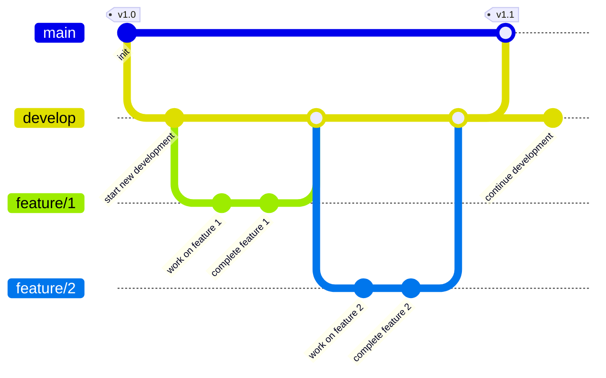

# Speedrun Tracker Frontend

Welcome to the Speedrun Tracker Frontend! This Vue.js application provides the user interface for managing and tracking speedruns, demonstrating modern DevOps practices in frontend development.

## Table of Contents

- [Features](#features)
- [Installation](#installation)
- [Usage](#usage)
- [Testing](#testing)
- [CI/CD Pipeline](#cicd-pipeline)
- [Contributing](#contributing)
- [License](#license)

## Features

- **Game Selection**: Browse and select games from the catalog
- **Speedrun Management**: Record and track speedruns with:
  - Runner information
  - Game selection
  - Category selection (e.g., Any%, 100%)
  - Completion time tracking
  - Date recording
- **Data Visualization**: View and sort speedruns by various criteria
- **Responsive Design**: Adapts to different screen sizes
- **API Integration**: Real-time connection status monitoring

## Installation

To get started with the Speedrun Tracker Frontend, follow these steps:

1. **Clone the repository**:

   ```bash
   git clone https://github.com/yourusername/speedrun-tracker-frontend.git
   cd speedrun-tracker-frontend
   ```

2. **Enable Corepack** (required for first time setup):

   ```bash
   corepack enable
   ```

3. **Install dependencies**:

   ```bash
   yarn install
   ```

4. **Set up environment variables**: Create a `.env` file in the root directory:

   ```plaintext
   VITE_API_BASE_URL=http://localhost:3001
   VITE_API_TOKEN=your_api_token
   HTTP_PORT=8080
   ```

5. **Start the development server**:
   ```bash
   yarn dev
   ```

## Usage

The application provides a user-friendly interface for managing speedruns. You can:

- Select games from the catalog
- Record new speedruns
- View existing speedruns
- Sort and filter speedrun data
- Monitor API connection status

## Testing

### Unit Tests

```bash
# Run tests with coverage
yarn test:coverage

# Run tests in watch mode
yarn test:watch
```

### End-to-End Tests

```bash
# Install Playwright browsers
yarn playwright install-deps
yarn playwright install

# Run E2E tests
yarn test:e2e
```

### Code Quality

```bash
# Lint code
yarn lint

# Format code
yarn format
```

## CI/CD Pipeline

The application uses Jenkins for continuous integration and deployment, implementing a simplified Gitflow workflow.

### Branch Strategy

- `main`: Production-ready code
- `develop`: Integration branch for features
- `feature/*`: Feature development branches

#### Branching Strategy Diagram



### Environment Configuration

#### Ports

- Production (main branch): 8080
- Test (develop branch): 8081
- Feature branches: 5000-5499 (dynamically assigned)

#### Environment IDs

- Production: `prod`
- Test: `test`
- Feature branches: `review-{branch-name}-{build-number}`

### Pipeline Stages

1. **Checkout**: Fetches the latest code
2. **Setup**: Prepares the development environment
3. **Unit Tests**: Component testing
4. **Build**: Creates Docker images
5. **Deploy**: Environment-specific deployment
6. **E2E Tests**: Integration testing
7. **Cleanup**: Resource management

### Required Jenkins Credentials

- `app-api-token`: API authentication token

### DevOps Learning Points

#### 1. Continuous Integration (CI)

- Automated testing on every code change
- Code quality checks
- Regular integration into develop branch
- Containerized environments

#### 2. Continuous Deployment (CD)

- Automated deployments
- Feature branch deployments
- Production deployments from main branch
- Environment-specific configurations

#### 3. Best Practices

- Environment separation
- Port isolation
- Automated cleanup
- Version tagging
- Secure credential management
- Parameterized builds

### Configuration Management and 12-Factor Methodology

This frontend application follows the [12-factor app methodology](https://12factor.net/):

#### 1. Config as Environment Variables

- All configuration in environment variables
- No hardcoded configuration
- Pipeline-injected configurations
- Local-only `.env` files

#### 2. Dev/Prod Parity

- Consistent environments
- Docker-based deployment
- Configuration-only differences
- Reliable environment reproduction

#### 3. Port Binding

- Self-contained application
- Configurable ports
- Dynamic port assignment
- Environment-specific routing

### Port Management

The pipeline implements dynamic port assignment:

- Production: Fixed port 8080 (http://localhost:8080)
- Test: Fixed port 8081 (http://localhost:8081)
- Feature branches: Dynamic ports 5000-5499
- Port overrides via pipeline parameters

## Development Tools

Recommended VSCode setup:

- [VSCode](https://code.visualstudio.com/)

## Learning Resources

- [Jenkins Documentation](https://www.jenkins.io/doc/)
- [Docker Documentation](https://docs.docker.com/)
- [Vue.js Documentation](https://vuejs.org/)
- [DevOps Best Practices](https://docs.github.com/en/actions/guides/about-continuous-integration)

